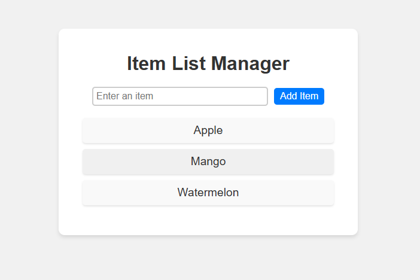

# Item List Manager

## Description
Item List Manager is a simple React application that allows users to manage a list of items. The application lets users add new items to the list via an input field. The list is displayed in an unordered list (`<ul>`), and items are added dynamically.

## Features
- Display an empty list when the app loads.
- Add new items to the list by typing in the input field and clicking the "Add Item" button.
- Clear the input field after adding an item.
- Prevent adding empty items to the list.
- Item list is displayed with alternating background colors for better readability.
- Hover effect for better interaction with items.

## How to Run

1. Clone this repository to your local machine:

   ```bash
   git clone https://github.com/sanketmudaraddi/item-list-manager.git
   ```
   
2. Navigate into the project directory:

   ```bash
   cd item-list-manager
   ```

3. Install the dependencies:

   ```bash
   npm install
   ```

4. Run the application:

   ```bash
   npm start
   ```

5. The application will be running on `http://localhost:3000`.

## Technologies Used
- React
- JavaScript
- CSS (for styling)

## Screenshot

